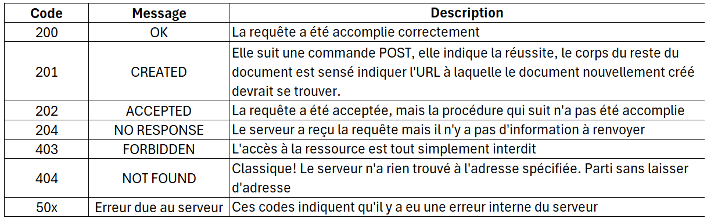
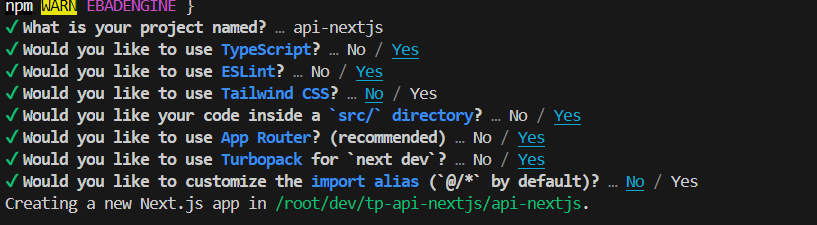

# API

Utilisation de la stack nodeJS pour le backend, en continuité avec le javascript qui est un outil pour utilisation de site dynamique.

Les notes = TP noté en fin de module et derniere demi journée 5 et 6 fevrier 2025

## Les API 

Nous allons dans un premier temps utiliser les API avec le TP Stapi cinema

API : application programming interface : API  permet d'acceder à un service comme des données ou des fonctionnalités fournies par un systeme tiers 
dans ce cas on dit le systeme tier expose une API.

Il y a une communication entre 2 applications afin de fournir les données dans un format souhaité; parmis c'est 2 applications une consommatrice du service et l'autre productrice de se service.

C'est egalement une interface de programmation qui permet de gerer de la base de donnée de maniere **securisée**; la gestion des rôles, gestions des droits.
Cela n'est pas seulement une solution technique, l'API fournit une opportunité business en effet elle peut etre payante pour certaines fonctionnalité tel que l'utilisation de google maps dans l'app UBER.


-> permet à 2 application de communiquer sans se soucier de la maniere dont l'autre est codée.
Techno possible 
- REST (HTTP => Texte ou JSON)
- SOAP (XML) : a definir
- GraphQL (auto-doc en MBA 1) : gros points fort auto documentation, c'est de l'auto completion pas besoin de connaitre la techno pour utiliser
- RPC (données binaire type protobuf) : google, utilistaion tres petit, tres formaté echange de donnée binaire
- ...


## Les API REST

API REST : Une API REST permet à des logiciels d'applications utilisant différents systèmes d'exploitation à interagir et partager des informations par l'intermédiaire du **protocole HTTP**. Une maniere uniforme mais non obligatoire de faire des API

REST: REpresentational State Transfer; C'est une API qui a ete construite selon les standards du web.

REST c'est une architecture logicielle basée sur le http. HTTP c'est un protocole de reference qui définit les communication sur le web. On va donc s'appuyer sur ce protocole http pour concevoir l'api REST.

API c'est le quoi ? REST c'est le comment ?

Une maniere uniforme mais non obligatoire de faire des API mais en choisiant REST c'est une garantie d'une meilleure integration aux communications du web
Sans connaitre API et de maniere uniforme de creer l'api
RestFul = API REST respectant les prinsipes de REST
- Stateless
- Uniform Interface
- Cacheable
- Clent-Server
- Layered System
- Code on demand (optionnel)

API RESTFUL - < CRUD>

- GET : /api/:pluralApiId                   get a list of entries
- POST : /api/:pluralApiId                  create an entry
- GET : /api/:pluralApiId/:documentId       get an entry
- PUT : /api/:pluralApiId/:documentId       update an entry
- DELETE : /api/:pluralApiId/:documentId    delete an entry


pluralApiId = restaurant**s**

Les méthodes PUT et PATCH ont des significations différentes :

- PUT, remplace les données par celle qui sont envoyées dans la requête c'est à dire TOUS les elements, il faudra donc envoyer tous les champs !!
 mais ne fonctionne pas dans notre cas pour la bonne pratique si il y a une modification partielle il est preferable d'utiliser PATCH.
- PATCH, permet la modification partielle d'une ressource en fusionnant les données envoyées avec les données déjà présentes ou grâce à 
l'utilisation d'opération de modification.


```nodeJS
const express = require('express)

```


https://docs.strapi.io/dev-docs/api/rest/sort-pagination#sorting


DESCRIPTION DE L'API


Revoir les differents reponse HTML : http://mathartung.xyz/nsi/cours_requetehtml.html




Comment tester une API ?

- postman : interface first preference visuelle, partager le travail possible mais cela reste au format de postman, donc si changement probleme
- insomnia : interface first preference visuelle, partager le travail possible mais cela reste au format de insomnia, donc si changement probleme
- curl : ligne de commande brut, c'est un outil de base il peut faire les requetes http
- Rest Client VScode : on peut ecrire les requete la ou on a le code dans VS marche que dans les fichier HTTP.  genere des fichier un peu comme md dans le dossier de notre tavail
- Bruno : nouveau c'est un juste milieu entre postman et insomia et RestClient 
- fetch avec navigateur: possibilite mais seulement pour faire des get


Les Headless CMS

CMS = Content Management System (système de gestion de contenu) est une plateforme logicielle permettant de créer, organiser et publier du contenu sur un site web ou application. Le plus connu Wordpress.

+Headless CMS = sans interface graphique
= API sans coder

C'est Wordpress sans le front/Theme --> On va utiliser **Strapi**
Strapi est un open-source headless CMS, à la difference de wordpress il ne gere pas les vus il expose les données sous formes d'API, l'avantage est le choix de la stack niveau base de donnée 
Head c'est l'interface 


### TP Strapi Cinema


- recuperer une liste de films recents
- recupere les details du deuxieme film de la liste
- recupere les acteurs d'un film
- recupere les informations d'un acteur


Headers est comme une source d'informations supplémentaire pour chaque appel d'API que vous effectuez. Leur rôle est de représenter les métadonnées associées à une demande et une réponse d'API. Un des header important est le content type  pour avoir le type de donnée que l'on appelle

lancer plusieurs get ou bien lancer une page web on voit plein d'elements lancés en meme temps c'est pour jouer sur la performance et une histoire de paralelelisme
c'est interet du rest avoir de petites requetes à l'opposé de graphql

uuid : les id sont souvent en chaine de caractere pour eviter une colision et avoir 2 meme id on utilise les timestamp. On peut egalement paralellisé les bases de données.  c 'est pour ça que le timestamp ajout une heure et d'autre element


populate=* voir les dependance


refaire le meme exo en graphql pour info

aller dans marketplace : documentation et graphql dans strapi a installer


tester les json : https://jsonchecker.com/


### Nouveau projet 

https://expressjs.com/


Utilisation de CRUD classique :

il nous faut des ressources, definir des tables, puis definir des champs c'est l'aspect base de donnée on peut utiliser un ORM exemple le plus courant Sequelize


ORM: désigne une technique de programmation informatique qui crée un pont entre les bases de données relationnelles et le paradigme de la POO
Il met à disposition des classes objet permettant de manipuler les bases de données relationnelles. On manipule ainsi des objets et l’ORM transforme le tout en requêtes compréhensibles par la base de données: exemple : sequelize, django

L'interet de l'orm permet de lier la base de donnée et le code et donc ne plus toucher à la base de donnée en cas de modification, les données seront synchronisées en conservant l'historique des modifications.


exemple autre que sequelize : https://www.sitepoint.com/javascript-typescript-orms/

mern stack : mongodb-react-nodejs nosql un peu ancien 

pern stack : postregree-react-nodejs stack à jour !! 
pean stack : angular   : https://www.mobiskill.fr/blog-posts/perns-vs-pean-quelle-stack-choisir-en-2021

Qu’est-ce qu’un ORM ?

Un ORM (Object-Relational Mapper) fournit une couche orientée objet entre les bases de données relationnelles et les langages de programmation orientés objet sans avoir à écrire de requêtes SQL. Il standardise les interfaces en réduisant le passe-partout et en accélérant le temps de développement.

https://wetic.be/quest-ce-quun-orm-et-pourquoi-devriez-vous-lutiliser/


Il faut creer la partie content builder , puis les routes etc ... tech qu'on peut utiliser c'est express node.js ou nest.js le plus à jour : https://nestjs.com/


.nvmrc c'est un fichier pour connaitre la version node qui fonctionne dans le projet

sequelize c'est pour se connecter à la base de donnée


creer express : 
Express.js : Express.js est utilisé pour créer API et applications mobiles. 
Il prend en charge les détails essentiels du backend tels que 
- les sessions, 
- la gestion des erreurs 
- le routage. 
Il gére des demandes et des réponses http variées et multiples pour des URL spécifiées.

- 1er partie : instancier express: installer expressjs
- 2eme partie middleware :   https://www.youtube.com/watch?v=kv3PCAQXJmY
- 3eme partie les CORS : 
- 4eme partie body qui est lu comme du text. Si c'est du json va valoir parser, on utilise donc bodyparser ou bien express qui a deja la capacité de parser le body
- 5eme partie c'est la suite de route un comportement get etc... app.get
- 6eme partie de lancer le code et de le laisser tourner .env attention toujours des chaines de caractere pour charger les variable d'envi et le mettre dans process il y un import . avec le code process.env.PORT()

a reprendre le cours et structurer avec le code et les explications 


```ts
app.post(`api/ddd`, async (req,res) => {
const voiture

})

```
req.param c'est pour recuperer les parametres exemple /api/:voiture/:id

voir la def de query permet de recupere les variables dans le lien exe .../api/voiture/2?fields=id&toto=tata query'id et toto


A REVOIR LA DEF QUERY / QUERIES

```ts
const data ) await Conducteur.findAll({
    include: Voiture,
    where: {
        FirstName:"Jean"
    }
})
```
--> c'est comme un select de sql


Demain on utilisera prsima

api permet d'envoyer donnée en utilisant diffrente methode :
- query,
- params, /id
- et les element qu'on met directement dans l'url


pour react pour une interaction https://mobx.js.org/react-integration.html


### L'authentification dans les API


On peut faire de la securité encore plus poussée avec la demande d'autentification, besoin du serveur pour pouvoir se connecter. 

On veut s'assurer que la personne possede les droits, elle doit faire donc partie d'un listing c'est ce qu'on appelle l'authentification. 
A ne pas confondre avec l'autorisation qui est la possibilité de differencier les differents profils er roles.

L'autentification permet de laisser des traces des utilisatuers pour assurer un suivi  : exemple Thomas s'est loggé deux fois aujourd'hui, panier validé par Thomas....
Côté autorisation est ce qu'il a le droit de... ? exemple Thomas peut-il recuperer la liste de films


#### Comment s'autentifier : 

-   Le login : à ne plus trop utiliser maintenant
-   Autentificateur google authentifactor, microsoft c'est une autentification ephémere, qui est beaucoup mieux, avec une notion d'instantaneité, le mtp ne reste pas longtemps, coté securité plus plus.
-   single SSO : sign in with google / github .... : beaucoup plus safe d'utiliser cette methode, gagner du temps en terme UX :
            + RGPD, connecté plus vite , SSO un mot de passe securisé a fond
            - probleme si un compte est piraté il ya un risque d'avoir acces aux autres comptes / autre problematique : force utilisateur d'avoir un compte lié au sign ,de plus,  on a une dependance sur ça exemple : Google recupere certaines info comme les frequence utilisation de notre site.

- passkeys : un passkey est une clé cryptographique conçue pour remplacer les mots de passe.Comme les anciens mots de passe pouvaient facilement être volés, piratés ou même devinés, les passkeys fonctionneraient à un niveau complètement différent, avec l'authentification par paires de clés publique-privée.
Contrairement à un mot de passe, les passkeys ne peuvent pas être partagés, mémorisés ou écrits. Ils sont donc beaucoup moins vulnérables aux types d'attaques qui visent généralement les systèmes basés sur des mots de passe.
Lorsqu'un passkey est créé, deux clés cryptographiques sont générées :

1. La clé publique : La clé publique reste sur le serveur du fournisseur de services. Elle n'est pas sensible en soi et ne peut pas être utilisée pour accéder à votre compte.
2. La clé privée : Cette clé est conservée sur l'appareil de l'utilisateur, comme un smartphone. Elle ne quitte jamais l'appareil et est toujours protégée par une forme forte de vérification de l'utilisateur.
hyper fort !!! Tres puissant

- 2FA : double autentification : 
- cle usb comme dans les paiements .
- biometrie partie 2FA

Besoin :

- identifiant : email, pseudo, ... 
- mot de sécurité : mot de passe, clé, certificat, ...
- KYC ? know your customer : besoin de savoir que c'est bien cette personne, justificatif gros process exemple Aribnb et Blablacar qui demande une verifiaction identité apres pour completer le profil
- aide à la connexion : OAuth, SSO, ...
- retrouver / modifier ses données d'authentification

##### Basic Auth
Envoi de l'identifiant et du mot de passe à chaque requête
L'identifiant et le mot de passe sont stockés par le client (en clair) Basic Thomas:1234

autorisation bearer .... --> bearer c'est du texte L'authentification bearer est un schéma d'authentification HTTP qui faisait à l'origine partie de RFC 6750: The OAuth 2.0 Authorization Framework-Bearer Token Usage.


Il existe autre que bearer c'est basic : L'authentification d'accès de base est une méthode permettant à un agent utilisateur HTTP (par exemple un navigateur web) de fournir un nom d'utilisateur et un mot de passe lors d'une requête.
https://blog.behrouze.com/basic-auth 

Basic:
man is in the middle : dans le web il y a different passages et requete sous forme de pacakges envoyés dans les requete qui doivent donc etre crypté.
Probleme : c'est que le code doit etre stocké quelque part; pour stocker un element dans un site localstorage...


##### Token JWT
Envoi d'un token à chaque requête
- Le token est généré par le serveur
- Le token est stocké par le client
- Le token est valide pendant un certain temps

On arrive sur un site on se login, etc.... quand on change de page on ne redemande pas de mot de passe. 
C'est grace au token, qui est transmis au client et conserver. 


##### 3. OAuth

- Le token est généré par un tiers de confiance
- Le token est stocké par le client
- Le token est valide pendant un certain temps

Le token est confié a un tiers de confiance. 


### Qu'est ce qu'un hash ?

Tres rapide a generer c'est un algo, c'est unique, en cas de doublon on parle de collision

Les collisions de hachage se produisent lorsque deux entrées différentes produisent le même résultat de hachage. Les collisions de hachage sont certes rares, mais elles constituent un risque pour la sécurité, car un pirate pourrait délibérément créer un mot de passe différent qui génère le même hachage que le mot de passe original, ce qui lui permettrait d’obtenir un accès non autorisé.
Le hashage est : 
- offusquer/cache
- irreversible : Il s’agit d’une fonction à sens unique.Il est impossible de faire de l’ingénierie inverse et de retrouver le mot de passe original à partir de sa forme hachée. 
- rapide
- unique : unicité des H

exemple qu'on voit en hash : jeu video, commit.

Une fonction de hachage est une **fonction** qui, à partir d'une donnée fournie en entrée, calcule **très rapidement** une **empreinte unique** de cette donnée,
de sorte que toute modification de la donnée entraîne une modification **significative** de l'empreinte (la sortie).

  Exemples :

  - watcher :
  - bitcoin : avce la blockchain block c'est stocké des informations dedans, suite d'operation qui se transmettent de l'argent , il y a une notion de hash, il faut hasher les informations et il faut miner les blocks cad qu'on lance un aleatoire autant de fois jusqu'au tomber sur plusieurs 0 au debut. 
  La on securise le block; puis on passe au block suivant on ajoute le hash du block 1 et on inject dans le hash du block 2 et on doit retrouver le hash du block 2. 
  Donc impossible de revenir en arriere si on casse le hash le bitcoin vont 0.
  - mot de passe : pas de moyen de revenir en arriere avec des mot de passe hash
  - commit 
  - jeux video


L'attaque des hash c'est par dictionnaire, si on trouve un hash avec un mtp ex toto et dans la base de donnée il y a le meme mtp alors on a le meme hash.
Pour contrer cette attaque il faudra ajouter un element pour securisé le hash exemple de la blockchain (aleatoire + recupere le hash d'avant)

On genere donc le hash du mtp + un truc aleatoire (salt) / difficile de revenir à la base 


### Qu'est ce qu'un JWT

Mtp tres visible, mais jamais stocker des mot de passe dans une base de donnée. 


https://jwt.io/


- JSON Web Token
- Un token est formé de 3 parties séparées par un point
  - La première partie est l'entête (type de token, algorithme de hashage)
  - La deuxième partie est le payload (données) : c'est la donné qu'on veut injecter dans le token , meta donnée c'est la data de creation du token
  dans les meta donnée à voir les librairies : https://jwt.io/libraries

  - La troisième partie est la signature (hash de la première et deuxième partie) c'est la partie la plus importante car les 2 1eres parties sont visibles. 
  il reprend les elemnts du token, le hash  ajout un autre element secret que nous seul connaissont.
 -  partie decod
  - partie verify
Ce truc secret est un enjeu de securité. 

- Bearer (mot clé a inscrire)


### HTTP vs HTTPS

En quoi HTTPS permet de sécuriser l'authentification ?

- HTTPS = HTTP + SSL


## JWT avec express

Utiliser le paquet `jsonwebtoken`
=> https://www.npmjs.com/package/jsonwebtoken

```js
const jwt = require("jsonwebtoken");
jwt.sign({ foo: "bar" }, "your-secret-key-dans-un-fichier-env", { expiresIn: "1h" });
jwt.verify(tokenWithoutBearerAndSpaceFromAuthorizationHeader, "your-secret-key-dans-un-fichier-env");
```


## Mot de passe

C'est quoi un bon mot de passe,
- un mot de passe pas reutilisé, 
- long avec chaine de charactere, 
- changer regulierment, 
- pas sauvegardé autre endroit, 
- ne pas savoir le mot de passe
- ne pas le confier

Gestionnaire de mot de : bitwarden 
lastPass / Dashlane


long + caractere ... c'est brut force. Pour eviter les essais repetitives toutes les combinaisons, on evite les date anniversaire et les nom de chat.

Lorsque je change de mot de passe il ne change pas 
si mot de passe est deja utilisé sur un site il conserve les hash et verifie les hash.

scrapping droit à la base de donnée, on a pas le droit de copier les base de données des autres. 

base64 avec une rechercher sur google : express basic auth

buffer qui transforme une base64 U2FicmlzdGk6a2l3a en chaine de caractere


Middleware associer à use et next,  c'est est une focntion qui a 3 parametres (req, res, next)


important : https://www.npmjs.com/package/bcrypt

bcrypt c'est un generateur de hash avec element qu'on connait et la partie secret

salt_round : salt c'est un point d'entrée, un nombre aleatoire est une suite d'operation avec un point d'entrée et des operation dans tous les sens; En info on a pas vraiement de l'aleatoire, c'est du pseudo random
SALT_ROUTE : c'est le point d'entrée poour creer un alteatoire salt_ROUTE : 10 c'est deja complexe. à voir dans la doc.

pour notre projet a voir prisma.


micro service avec docker à voir petit bout de code qu'on mixe


Next.js Framework de node.js :
- next.js sur la stack react l'outil qui permet de faire full stack
- (nuxt.js pour la stack vue c'est faire du front et du back. )
concernant Next.js Il y a des choix fort dans l'utilisation de ces stack exemple :
- choix fort du routing par fichier : a chaque route creer on doit creer un fichier api/toto/route.js
- serverless : serveur qui n'est pas toujours allumé pour le projet. il se lance des qu'on l'appelle. Ce sont des fonctions qui sont prete à etre lancés
Mode serverless on doit faire des choses tres petit, marche bien avec le backend. On ne fait pas ça en interne. 
Avantage : performance, gain d'argent...
https://guide.sst.dev/chapters/fr/what-is-serverless.html


https://vo.dev/



mettre tout par default


TP : on va utiliser prsima

faire un qcm avec 5questions : avoir plus de question dans la base de donnée, une reponse ou plusieurs choix multiples, 
un intilué 4 proposition 


On va utiliser prisma un ORM : https://www.prisma.io/ à voir tres puissant   
https://www.prisma.io/docs/getting-started/quickstart-sqlite

https://neon.tech/docs/guides/node


on va sur neon : une base de donnée en ligne

vercel : deploiement gratuit


Objectif aujourd'hui et de faire un TP avec express et prisma


Mercredi :
https://authjs.dev/?_gl=1*15z1rj9*_gcl_au*MTYwNDAxMTY5LjE3Mzg3NDE1OTA.


providers : 
credentials : un paquet dans la librairie de auth.js pour s'authentifier
resend : envoie de mail pour identifier
  
  
  cde a taper pour installer prisma :

  npm install prisma --save-dev

  npx prisma init


  pour hasher installer bcrypt
  npm install bcrypt

  Middleware se sont des etapes 
  

  d.ts pour ajouter un tiping request token?


  cours univ : https://cours-info.iut-bm.univ-fcomte.fr/upload/supports/S3/web/cot%20serveur/R401%20-%20services%20web/Week%201%20-%20authentication.pdf


# Definition à connaitre 

## API


application programming interface  permet d'acceder à un service comme des données ou des fonctionnalités fournies par un systeme tiers dans ce cas on dit le systeme tier expose une API.

Il y a une communication entre 2 applications afin de fournir les données dans un format souhaité; parmis c'est 2 applications une consommatrice du service et l'autre productrice de se service.

C'est egalement une interface de programmation qui permet de gerer de la base de donnée de maniere securisée; la gestion des rôles, gestions des droits. Cela n'est pas seulement une solution technique, l'API fournit une opportunité business en effet elle peut etre payante pour certaines fonctionnalité tel que l'utilisation de google maps dans l'app UBER.

Exemple de Techno 

- REST (HTTP => Texte ou JSON)
- SOAP (XML) : a definir
- GraphQL (auto-doc) 
RPC (données binaire type protobuf) 

## API REST
C'est une API qui a ete construite selon les standards du web. REST c'est une architecture logicielle basée sur le http. HTTP c'est un protocole de reference qui définit les communication sur le web. On va donc s'appuyer sur ce protocole http pour concevoir l'api REST afin de garantir une meilleure integration aux communications du web
## PUT / PATCH
- PUT, remplace les données par celle qui sont envoyées dans la requête c'est à dire TOUS les elements, il faudra donc envoyer tous les champs !!
 mais ne fonctionne pas dans notre cas pour la bonne pratique si il y a une modification partielle il est preferable d'utiliser PATCH.
- PATCH, permet la modification partielle d'une ressource en fusionnant les données envoyées avec les données déjà présentes ou grâce à l'utilisation d'opération de modification.
## CMS
CMS = Content Management System (système de gestion de contenu) est une plateforme logicielle permettant de créer, organiser et publier du contenu sur un site web ou application. Le plus connu Wordpress.

Strapi est un open-source headless CMS (cad sans interface graphique), à la difference de wordpress il ne gere pas les vue il expose les données sous formes d'API, l'avantage est le choix de la stack niveau base de donnée 

## ORM

Un ORM (Object-Relational Mapper) fournit une couche orientée objet entre les bases de données relationnelles et les langages de programmation orientés objet sans avoir
 à écrire de requêtes SQL. 
Il standardise les interfaces en réduisant le passe-partout et en accélérant le processus de développement.
L'interet de l'orm permet de lier la base de donnée et le code et donc ne plus toucher à la base de donnée en cas de modification, les données seront synchronisées en conservant l'historique des modifications.

Le plus connu : sequelize, prisma 

## Express.js

Express.js : Express.js , frameword de Node.js est utilisé pour créer API et applications mobiles. 
Il prend en charge les détails essentiels du backend tels que 
- les sessions, 
- la gestion des erreurs 
- le routage. 
Il gére des demandes et des réponses http variées et multiples pour des URL spécifiées.

## Next.js
Framework basé sur Node.js , principalement pour le frontend, mais peut aussi gérer le backend avec des API routes.
Il y a des choix fort dans l'utilisation de cette stack :
- choix fort du routing par fichier : a chaque route creer on doit creer un fichier api/toto/route.js
- serverless : serveur qui n'est pas toujours allumé pour le projet. il se lance des qu'on l'appelle. Ce sont des fonctions qui sont prete à etre lancés : gain d'argent


## AUTHENTIFICATEUR DU TYPE GOOGLE/MICROSOFT

## PASSKEY
Un passkey est une clé cryptographique conçue pour remplacer les mots de passe.IL fonctionne grâce à l'authentification par paires de clés publique-privée.

Contrairement à un mot de passe, les passkeys ne peuvent pas être partagés, mémorisés ou écrits. Ils sont donc beaucoup moins vulnérables aux types d'attaques.

Lorsqu'un passkey est créé, deux clés cryptographiques sont générées :

1. La clé publique : La clé publique reste sur le serveur du fournisseur de services. Elle n'est pas sensible en soi et ne peut pas être utilisée pour accéder à votre compte.
2. La clé privée : Cette clé est conservée sur l'appareil de l'utilisateur, comme un smartphone. Elle ne quitte jamais l'appareil et est toujours protégée par une forme forte de vérification de l'utilisateur.

## HASH
Une fonction de hachage est une **fonction** qui, à partir d'une donnée fournie en entrée, calcule **très rapidement** une **empreinte unique** de cette donnée,
de sorte que toute modification de la donnée entraîne une modification **significative** de l'empreinte (la sortie).Egalement irreversible : Il s’agit d’une fonction à sens unique.Il est impossible de faire de l’ingénierie inverse et de retrouver le mot de passe original à partir de sa forme hachée. 

exemple de hash : jeu video, commit.


bcrypt c'est un generateur de hash avec element qu'on connait et la partie secret

## HEADER
Headers est comme une source d'informations supplémentaire pour chaque appel d'API que vous effectuez. Leur rôle est de représenter les métadonnées associées à une demande et une réponse d'API. Un des header important est le content type  pour avoir le type de donnée que l'on appelle
## MIDDLEWARE
C'est une couche technique entre l'OS (sys exploitation) et la couche applicative. Son rôle c'est aider les logiciels et appliactions à interagir ensemble. Il fournit des services récurrents permettant de faire circuler les données entre app sans que cela n'ait ete prevu pour. Le but est de simplifier le dev sans penser aux contrainte exterieur

## BASIC AUTH
Envoi de l'identifiant et du mot de passe à chaque requête (acces ressource)
Processus qui permet d'authentifier l'accès à une ressource contenue sur un serveur à travers d'un login et d'un mtp. A chaque fois que l'on souhaite acceder à une ressource 
il faudra indiquer dans le header le login et mtp exemple Basic Thomas:1234
## BEARER AUTH
L'authentification du porteur (Bearer), également connue sous le nom d'authentification basée sur les token, est une méthode d'authentification 
des utilisateurs en passant un token d'accès dans les headers de requête.

Le token est généralement généré par le serveur et envoyé au client une fois l'authentification réussie.

Le client inclut ensuite le token dans les requêtes ultérieures adressées au serveur pour prouver son identité.

Avantages :
- Le token est sans état (stateless), ce qui signifie que le serveur n'a pas besoin de maintenir
une session ou de stocker des informations sur l'utilisateur
- Les tokens peuvent être facilement révoqués ou expirés par le serveur
- Les tokens peuvent être signés cryptographiquement pour empêcher la falsification


## TOKEN JWT

Envoi d'un token à chaque requête
- Le token est généré par le serveur
- Le token est stocké par le client
- Le token est valide pendant un certain temps


JSON Web Token (JWT) est une norme ouverte  qui définit un moyen compact et autonome pour transmettre en toute sécurité des informations en objet JSON.
Ces informations peuvent être vérifiées et approuvées car elles sont signées numériquement. Les JWT peuvent être signés à l'aide d'un secret (avecl'algorithme HMAC) ou 
d'une paire de clés publique/privée utilisant RSA ou ECDSA.
Dans sa forme compacte, les token Web JSON se composent de trois parties séparées par des points (.), qui sont :
- Entête : type de token, algorithme de hashage
- Payload : c'est la donné qu'on veut injecter dans le token , meta donnée 
- Signature : la signature (hash de la première et deuxième partie) + un secret

Avantages :
- Il est simple à mettre en œuvre, car il est basé sur JSON, un format d'échange de données
largement utilisé
- Il est sans état, ce qui signifie que le serveur n'a pas besoin de maintenir une session pour le
client, ce qui peut être utile pour l'évolutivité
- Il est autonome, ce qui signifie que le jeton contient toutes les informations nécessaires pour
authentifier l'utilisateur, éliminant ainsi le besoin d'interroger la base de données plusieurs
fois
- Il est largement pris en charge dans différentes plates-formes


## OAUTH
- Le token est généré par un tiers de confiance
- Le token est stocké par le client
- Le token est valide pendant un certain temps