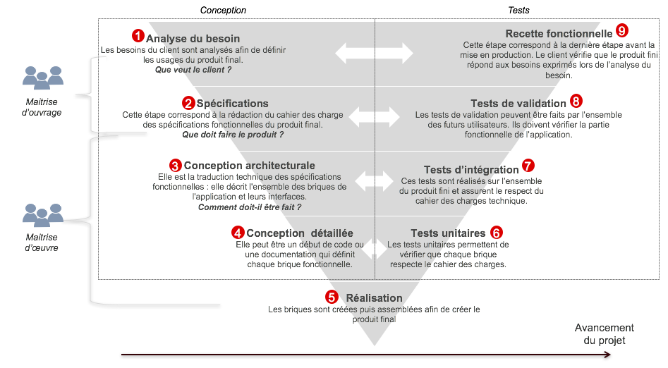
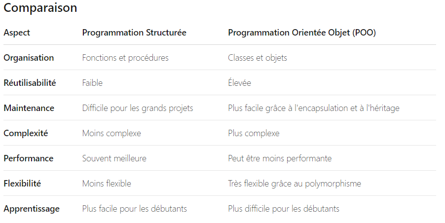
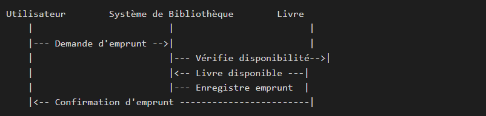
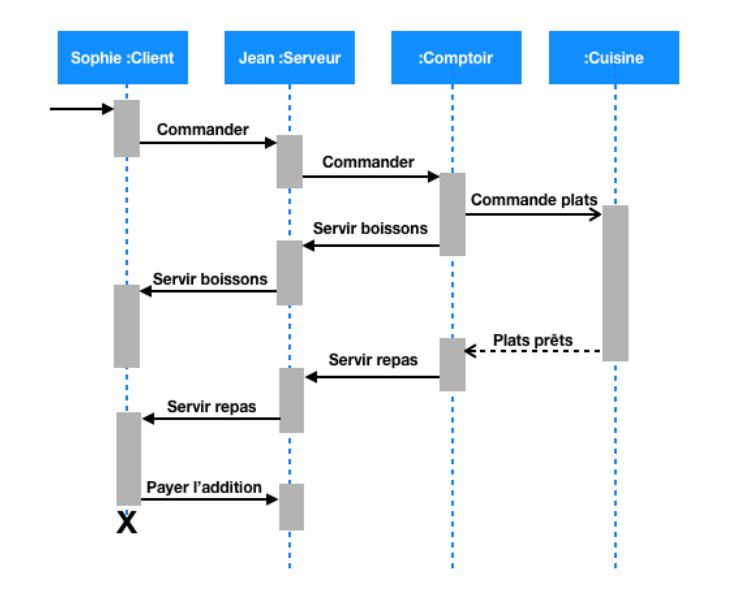
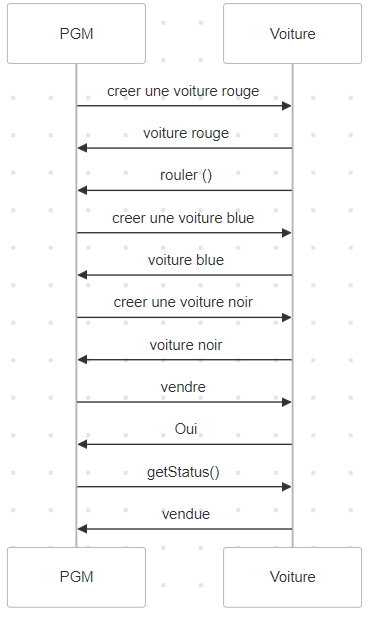

<h1 align="center">Conception Logicielle</h1>

# Cours

Metier proche du PO (product owner)
beaucoup de methodo dans la conception de logicielle c'est la phase avant de coder durant ce cours on parlant d'un nouveau langage UML.

## Modélisation

Modéliser : abstraction d'un phenomene complexe pour se rapprocher au mieux de la réalité. Il n'y a pas de point de vue parfait. Jugement, experience,...
Se rapprocher d'une réalité avec son propre point de vue; notion subjective.

Cette notion est tres forte dans le métier du PO qui est l'intermediare etre le dev et client

Informatisation ! hardware + software: ce sont des outils qu'on utilisera pour creer le process 

SI: Systeme d'information = Data : la matiere s'appelle SI; en entreprise il y a un pole SI (pour les grandes E) à ne pas confondre avec DSI (admin, reparation ordi...)

Cela se rapproche à des poste de type ingé bac+5

Modélisation : 2 grands concepts 
je pars d'un cahier des charges pour arrivée à 
- de la POO (programmation orienté objet) 
- schema de base de donnée


## Introduction

Les devs sont mauvais dans l'ensemble en 1995 constat selon les chiffres de la ***diapo***
- 9 % seulement des projet etaient conformes aux prévision initales
- 50% avaient subi des depassement en cout et delai d'un facteur 2 à 3 avec diminution du nombre des fonction offerte
- 30 int été purement abandonnée


## Génie Logiciel

objectif : optimiser les coûts du developpement logiciel pour contrer :(**charge** / **delai** 2 notions differentes = diagramme de Gant)
-   augmentation des coûts 
-   difficultés de maintenance et d'évolution
-   non-fiabilité
-   non-respect des spécifications
-   npn-respect des délais

-> Maintenance = 53 % du coût total du logiciel


**Charge**

La charge fait référence à la quantité de travail ou d'effort nécessaire pour accomplir une tâche ou un ensemble de tâches. Elle peut être mesurée en termes de temps (heures, jours, etc.) ou d'autres unités de mesure pertinentes pour le projet.

 La charge est souvent utilisée pour évaluer la capacité de travail des ressources (personnes, équipes, machines) et pour planifier l'allocation de ces ressources.

Exemples :

-   Un déve peut avoir une charge de 40 heures de travail par semaine.


**Délai**

Le délai fait référence à la durée totale nécessaire pour accomplir une tâche ou un projet, y compris les temps d'attente, les dépendances entre les tâches, et les contraintes externes. 

Le délai prend en compte non seulement le temps de travail effectif, mais aussi les périodes où le travail ne peut pas être effectué (par exemple, en attendant des approbations, des livraisons, etc.).

Exemples :

-   Une tâche peut avoir un délai de 3 jours, même si la charge de travail effectif est de 8 heures, en raison de dépendances ou de temps d'attente.
-   Un projet peut avoir un délai de 6 mois, en tenant compte des différentes phases, des approbations nécessaires et des contraintes externes.


## Pourquoi modéliser

Language commun qui permet de communiquer entre technicien et ceux qui sont là pour un besoin (client). Explorer et documenter un probleme avec des outils abstraits cad toujours etre à jour / non multi techniques, etat de l'art actuel du logiciel.

La conception permet d'apporter un éclaircissement au dev et egalement au client qui est confrontrer à une analyse de sa demande: les points qui ne fonctionne pas etc...


## Cycle en V

C'est un modèle de développement logiciel qui met l'accent sur la vérification et la validation à chaque étape du processus de développement




### Etapes du cycle V :

specification:  Avant tout chose on reflechit, on passe beaucoup de temps à reflechir poser des questions, triturer etc... beaucoup de spec, interview avec le clients, faire de la veille techno,...

conception detaillé: comment concretement doit se passer dans nos codes pour creer le logiciel. Définir les détails de chaque composant du système.Produire un document de conception détaillée.

codage: on fait des petit bout de code c'est à dire, écrire le code pour chaque composant du système.Produire le code source.

integration : on rassemble tous nos codes.

qualification : mettre des metrique, cad chiffrer sur nos codes, juger le code (possibilité de retour avec le codage si par exemple: le temps de chargement est trop long)

test unitaire : on fait du recetage cad qu'on teste chaque composant individuellement pour s'assurer qu'il fonctionne correctement. Produire des rapports de test unitaire.

validation : QA quality assurance (un métier à regarder) test du logiciel et valide que le système répond aux exigences initiales et aux attentes des utilisateurs.
Produire des rapports de validation.
****

Resultat du cycle en V c'est qu'à la fin de toutes ses etapes on peut etre loin de la demande client , on est loin du client dans le bas du V 

partie haute : client 

partie bas : developpement

*vs agilité qui l'objectif est d'etre toujours proche du client*

cycle en V c'est parfait pour parle de syste d'info etc... il faut etre bon dans les specs et travailler à petit echelle pour que le cycle V soit optimal !!


## Agilité/Lean

Agilité est une methode de travail, pas une methode de conception. 

On avance en etape sprint step by step pour arriver jusqu'au resultat demandé; le logiciel est utilisable rapidement. Le client a la visibilité rapidement sur son livré.
Penibilité au travail : il faut produire vite et mal, pb de repasser dessus sans cesse. Potentiellement on bosse sur un projet qu'on va devoir surement abandonner; On perd la noblesse de coder proprement. 

C'etait mieux avant VS il faut tout changer tout le temps !


## Programmation structurée vs POO


La programmation structurée et la programmation orientée objet (POO) sont deux paradigmes de programmation distincts, chacun ayant ses propres principes, avantages et inconvénients.

### Programmation structurée 

#### Principes

Division en Fonctions : Le code est divisé en fonctions ou procédures, chacune ayant une tâche spécifique.

Utilisation de Structures de Contrôle : Emphasis sur l'utilisation de structures de contrôle comme les boucles (for, while), les conditions (if, switch) et les séquences.

Modularité : Le code est organisé en modules ou fonctions réutilisables.


#### Avantages

-   Simplicité : Plus facile à comprendre et à apprendre pour les débutants.
-   Efficacité : Peut être très efficace pour des tâches spécifiques et bien définies.
-   Performance : Souvent plus performant en termes de vitesse d'exécution et de consommation de mémoire.

#### Inconvénients
-   Maintenance : Peut devenir difficile à maintenir et à étendre à mesure que la taille du projet augmente.
-   Réutilisabilité : Moins de réutilisabilité du code comparé à la POO.
-   Complexité : Peut devenir complexe à gérer pour des projets de grande envergure


### POO

#### Principes


Encapsulation : Les données et les méthodes sont regroupées dans des objets, ce qui permet de cacher les détails internes.

Héritage : Les classes peuvent hériter des propriétés et des comportements d'autres classes, permettant la réutilisation du code. C'est la transmission de caracteristique d'un objet à un enfant (attributs + methodes)

Polymorphisme : Les objets peuvent être traités comme des instances de leurs classes parentes, permettant une grande flexibilité.

Abstraction : Les détails complexes sont masqués, et seules les fonctionnalités nécessaires sont exposées.

#### Avantages
-   Réutilisabilité : Les classes et les objets peuvent être réutilisés dans différents projets.
-   Maintenance : Plus facile à maintenir et à étendre grâce à l'encapsulation et à l'héritage.
-   Modularité : Le code est organisé en classes et objets, ce qui facilite la gestion de la complexité.
-   Flexibilité : Le polymorphisme permet une grande flexibilité dans la conception et l'implémentation.

#### Inconvénients
-   Complexité : Peut être plus complexe à apprendre et à comprendre pour les débutants.
-   Performance : Peut être moins performant en termes de vitesse d'exécution et de consommation de mémoire en raison de l'overhead de la gestion des objets.
-   Conception : Nécessite une conception soignée pour éviter les problèmes de couplage et de cohésion.




Le livrable qu'on arrive rapidement c'est avec la POO
- l'identité
- les attributs
- les méthodes 

La difficulté de cette modélisation consiste à créer une representation abstraite, sous forme d'objets,d'entités ayant une existence matérielle (chien, voiture, ampoule, personne,...) ou bien virtuelle (client, temps,...).


## Historique 

A COMPLETER !!!

Smalltalk 1er language, puis evolution C+++ langage C + POO apparu en 1982
et java apparait 20 ans apres


## UML

Unified Modelin Language est né d'un effort de convergence. Il existe maintenant d'autres langages de modélisation : 
- plantUML : [le site](https://plantuml.com/fr/) Plus complet et plus recent que Mermaid : probleme fortement lié à java mais fonctionne avec la bonne extension
- BPM
- SysML
- Archimate

A regarder :  

C'est un peu comme les gitflow, il y a des variantes mais UML reste tres utilisé

Nous alons utiliser Mermaid on va creer des graphiques à partir de code


## Mermaid comme alternative

Markdown + Mermaid = UML et tout ca avec du git hub 

Pour creer des diagramme de séquence : [Lien vers Mermaid](https://www.mermaidchart.com/landing?utm_source=google_ads&utm_medium=primary_search&utm_campaign=mermaidecosystemfocus-G&gad_source=1&gclid=Cj0KCQjwveK4BhD4ARIsAKy6pMLQJO05CoDLMsOO7selpQw9g2Y0-MoT8Am_KXCGcszvFJ_IeELS85MaAkgtEALw_wcB)


 Pour creer des bases de données :[Lien pour dbdiagram](https://dbdiagram.io/home)


Differentes types de diagrammes pour la matiere :
-   use case
-   Sequence
-   Class

Pas de MCD : modele conceptiel de donnée

# TP tunnel d'achat

Consigne :

-   creation de projet
-   presentation au reste de la classe
-   participation à la confrontation de nos idées face aux autres

choisir une partie du tunnel d'achat et le modeliser en UML selon vos idées / préfences.

Etre capable de le presenter à l'oral et de confronter vos idées avec celles des autres

Dans une approche en cycle en V, comment integrer ce tunnel d'achat dans un projet de site e-commerce ? on ne va pas jusqu'à l'étape de codage. 

-   on part du use case 
-   en passant par le diagramme de séquence
-   jusqu'au diagramme de classe et la POO
-   jusqu'au MCD

Un dev n'est pas là pour coder. C'est un outil au service du métier. Il doit comprendre le métier et **améliorer les processus**. 

La technique est un moyen, pas une fin. Le role de PO


# 1ere etape : Use case

Un use case (cas d'utilisation) est une technique de modélisation utilisée dans le développement logiciel pour capturer les interactions entre les utilisateurs (ou d'autres systèmes) et le système à développer. 

Les use cases décrivent les fonctionnalités du système du point de vue de l'utilisateur et sont souvent représentés graphiquement à l'aide de diagrammes de cas d'utilisation (use case diagrams) dans le cadre de l'UML (Unified Modeling Language).

exemple actor=coiffeur : ces scenarios sont coiffer / prise RDV /encaisser / nettoyer

On veut livrer un logiciel (prise de rendez-vous et encaisser) donc on devra retirer les scenarios inutile cad qui ne rentre pas dans le besoin.
reste : prise rdv / encaisser

on ressors les use case : lister dispo / prise RDV anonyme ou specifique /encaisser 

**Acteurs** : Représentent les entités externes qui interagissent avec le système. Peut etre plusieurs suivant les scenarios qu'ils ont, cela peut prioriser nos etapes. Un acteur peut s'auto appeler 

**Cas d'Utilisation** : Les cas d'utilisation représentent les fonctionnalités ou les services que le système doit fournir.
Ils décrivent les interactions entre les acteurs et le système.

**Relations Association**: Une ligne reliant un acteur à un cas d'utilisation, indiquant que l'acteur interagit avec ce cas d'utilisation.


# 2eme etape - Diagramme de sequence

Un diagramme de séquence est un type de diagramme utilisé dans la modélisation des systèmes, notamment dans le cadre de l'UML (Unified Modeling Language). 

Il représente les interactions entre différents objets ou acteurs dans un système au fil du temps. 

Les diagrammes de séquence sont particulièrement utiles pour visualiser les flux de messages entre les objets et pour comprendre la chronologie des événements dans un scénario spécifique.



Cours explicatif : [ici](https://laurent-audibert.developpez.com/Cours-UML/?page=diagrammes-interaction#L7-2)




## Exemple de la voiture - diagramme de séquence



sequenceDiagram
    participant PGM 
    participant Animal

    PGM->>Animal: creer chat (cat, Barsik)
    Animal->>PGM: Cat et Barsik
    PGM ->> Animal: le transformer en chien
    Animal ->> Animal : changeToDog
    Animal ->> PGM : OK
    PGM ->> Animal: voice
    Animal ->>Animal : 
    Animal ->> PGM: Afficher (type+nom)
    PGM ->> Animal : getMyName()
    Animal ->> PGM : Barsik
    PGM ->> PGM : afficher 
    
```ts

class Animal {
  public name: string;
  public type: string;
 
  constructor(type: string, name: string) {
      this.name = name;
      this.type = type
  }
  voice() {
      console.log(`Cat ${this.name} says myau`);
  }
 
  transformToDog() {
      this.type = "Doggy";
  }
 
  ohNahnahWhatsMyName() {
    return this.name;
  }
 
}
 
const cat = new Animal("Cat", "Barsik");
// Transition animale
cat.transformToDog();
cat.voice();
 
const animalName = cat.ohNahnahWhatsMyName();
console.log("nom de l'animal après transformation : " + animalName);
```

Auto appelle ne se stock pas une fonction sans return et surtout sans une variable const
# 3eme etape - Diagramme de classe

Le diagramme de classe est une représentation visuelle de la structure d'une classe. Il montre les attributs et les méthodes de la classe, ainsi que leurs types et visibilités. Ce diagramme peut être utilisé pour comprendre la structure de la classe et pour documenter le code.


## Exemple de la voiture - diagramme de classe


### Nom de la Classe :

Voiture

### Attributs :

- couleur: string : Un attribut privé de type string représentant la couleur de la voiture.
- vendue: boolean : Un attribut privé de type boolean indiquant si la voiture est vendue ou non.

### Méthodes :

+ rouler(): void : Une méthode publique qui affiche "je roule".
+ vendre(): void : Une méthode publique qui met à jour l'attribut vendue à true.
+ getStatus(): string : Une méthode publique qui retourne le statut de la voiture ("vendue" ou "pas vendue").


### Ecriture du code sur mermaid:

classDiagram
    class Personne {
        name: string
        type: string
        transformToDog(): void
        voice(): void
        OhnananWhatsMyName(): void
    }


# 4eme etape - POO


## Exemple de la voiture - POO

```typescript
class Voiture {
    constructor(
        public couleur: string,
        public vendue: boolean = false
    ){}

    rouler (){
        console.log("je roule")
    }

    vendre(){
        this.vendue = true
    }
    getStatus(){
        return this.vendue ? "vendue" : "pas vendue"
        //condition ? expressionSiVrai : expressionSiFaux;
    }
}

const voitureNoire = new Voiture ("noire")
const voitureNoireEstVendueAvant = voitureNoire.getStatus()
console.log("Avant vente La voiture noire est " + voitureNoireEstVendueAvant)

voitureNoire.vendre()
const voitureNoireEstVendue = voitureNoire.getStatus()

console.log("La voiture noire est " + voitureNoireEstVendue)


const voitureRouge = new Voiture ("rouge")
voitureRouge.rouler()
const voitureBleu = new Voiture ("bleu")

```

Tous les attributs par defaut on le met en privé c'est la porté des variables. 
Les methodes sont la plupart du temps public

si on met une methode en privé : de l'exterieur si on veut acceder à la methode on ne peut pas 

Les attributs avec des _ devant afin de les distinguer avec les methode si on met un attribut en private exemple _type ; on creer une "methode" get :  get type(){ return this;_type}
On appelle ainsi : cat.type 

le set est pour attribuer un nouveau attribut afin de changer son comportement 
```ts
set type(newType :string){
    this._type = newType
}
cat.type ="Grenouille"

```

```ts
class Animal {
  public name: string;
  private _type: string;
 
  constructor(type: string, name: string) {
      this.name = name;
      this._type = type
  }
  
  voice() {
      console.log(`Cat ${this.name} says myau`);
  }
 
  transformToDog() {
      this._type = "Doggy";
  }
 
  ohNahnahWhatsMyName() {
    return this.name;
  }
 
  get type(){
    return this._type
  }
 
  set type(newType: string){
    this._type = newType
  }
 
}
 
const cat = new Animal("Cat", "Barsik");
// Transition animale
cat.transformToDog();
cat.voice();
 
cat.type = "Grenouille"
cat.name = "Toto"
 
const animalName = cat.ohNahnahWhatsMyName();
console.log("nom de l'animal après transformation : " + animalName);
```


