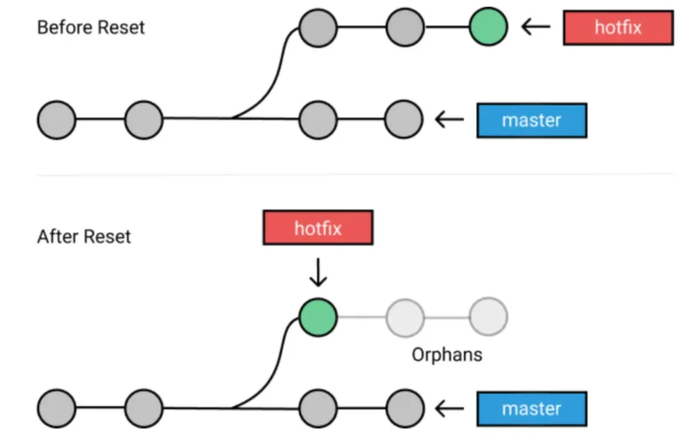
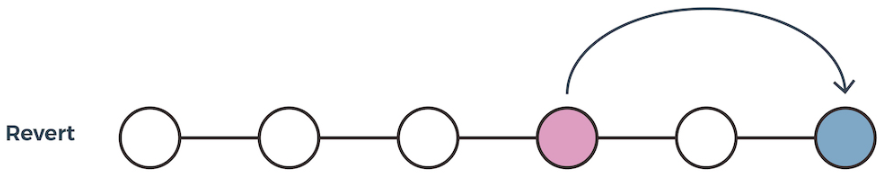
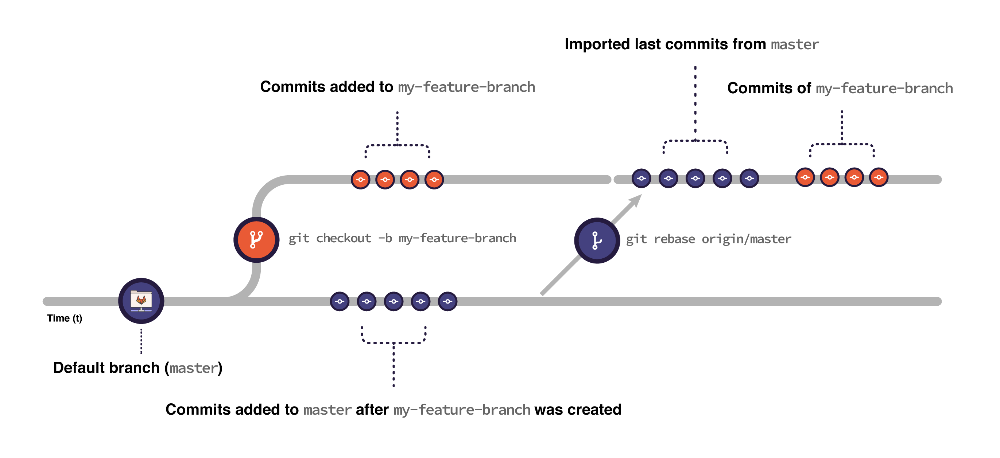

<h1 align="center" style="color:pink">Manipulation Git</h1>

# Les commandes essentielles 

## Les classiques

```git
git status 
```
Permet de voir l'état actuel du dépôt Git : 
-   Fichiers Modifiés : Les fichiers qui ont été modifiés mais pas encore ajoutés à l'index (staging area).
-   Fichiers Non Suivis : Les fichiers qui ne sont pas suivis par Git (non ajoutés au dépôt).
-   Fichiers Prêts à être Commités : Les fichiers qui ont été ajoutés à l'index et sont prêts à être commités.
-   Branche Actuelle : La branche sur laquelle vous vous trouvez actuellement.
-   État de la Branche : Si la branche est à jour avec la branche distante, en avance, ou en retard.
****


```git
git add <fichier>
or
git add .
```
Permets d'ajouter des fichiers ou des modifications de fichiers à l'index (staging area) de Git.
****

```git
git commit -m "message de notre commit"
```
Est utilisée pour enregistrer les modifications ajoutées à l'index (staging area) dans le dépôt Git. 
```git
git commit --amend -m "Correction de la documentation"
```
Modifie le dernier commit en ajoutant les modifications actuelles de l'index.
****


```git
git log
```
git log affiche tous les commit avec le user et la date
Est  utilisée pour afficher l'historique des commits dans un dépôt Git.

:q -> pour fermer le log
****


```git
git diff 
```
Permet d’ouvrir la vue des differences dans le code, ce sont la vue des modifications. 
****

```git
git stash 
```
Permet de mettre de côté les modifications non commitées dans une pile de stash
```git
git stash apply
```
Permey de recuperer les modifications mises de côté dans la pile de stash. 
****


```git
git push  // initialement git push -u origin main -> par defaut branche main
// A penser à se mettre sur la branche à push
git push -u* origin <branche>
```
*_si on ne souhaite plus retaper "origin <branche>" pour les prochaine fois sur cette branche_
Est utilisée pour envoyer les commits locaux vers un dépôt distant
--force ou -f : Force l'envoi des commits, même si cela écrase les commits existants sur la branche distante. A eviter ! 

****
```git
// A penser à se mettre sur main
git checkout main
git pull
```
Est utilisée pour récupérer les modifications d'un dépôt distant et les fusionner avec votre branche locale.

```git
git fetch 
```
Récupère les modifications du dépôt distant
****


```git
git chekout main
git merge [nom-de-la-branche]
```
Fusionne les modifications avec la branche locale. _git merge se placer avant dans main et faire un git merge [nom-de-la-branche]_
*****


## En cas de suppresions

```git
git reset <commit>
```
Si on souhaite annuler un commit et de revenir en arrière. On reset à la derniere version juste (si il y a d'autres commits ils seront supprimer). Va revenir à l'état précédent sans créer un nouveau commit


****

```git
git revert <commit> 
```

Si on souhaite annuler un commit précis en creant un nouveau commit qui vient annuler les changements.


## Travailler avec des branches 

```git
git branch toto 
``` 
Creer une nouvelle branche qui se nomme toto
****


```git
git checkout toto 
``` 
Se deplacer à la branche toto
****


```git
git checkout -b tata
``` 
On créer la branche tata et on se deplace 
****


```git
// se mettre dans la branche à remonter
git chekout [nom-de-la-branche]
git rebase main
``` 
On met a jour la branche en ce repositionnant à la derniere version du main
**Toujours faire un rebase avant de push !**



Exemple utilisation 

```git
git chekout main
git add
git commit -m
git branch tata
git checkout tata
git add
git commit -m
git rebase main
git push branch
// Se rendre sur GitHub et creer une merge request : mr
git checkout main
git pull
```
merge request : mr(GitLab) /  pull request : pr (GitHub) : c’est la fusion dans origin entre la branche main et la branche créée.

Lors du merge request on a 3 choix :
- create a merge commit
- suqash and merge : fusionner tous les commit dans la branche de travail et on l’inclus dans le main : pb on perd la graduation des branches(pas top !)
- rebase and merge : plus git flow, à choisir car bien plus propre


## Pensez à la methodo : git flow :sparkles:

Git Flow est un modèle de gestion de branches pour Git qui aide à organiser le développement de logiciels de manière structurée et cohérente :

- [x] branch main : contient le code production toujours en état de prod.
- [x] Eviter de travailler sur la branche main et créer d'autres branches
- [x] Penser à commit le plus possible
- [x] Utiliser rebase pour avoir la derniere version du main dans notre commits et gerer les conflits - git rebase avant chaque push !
- [x] Eviter de merge en local, la fusion des branches se fera dans orign

