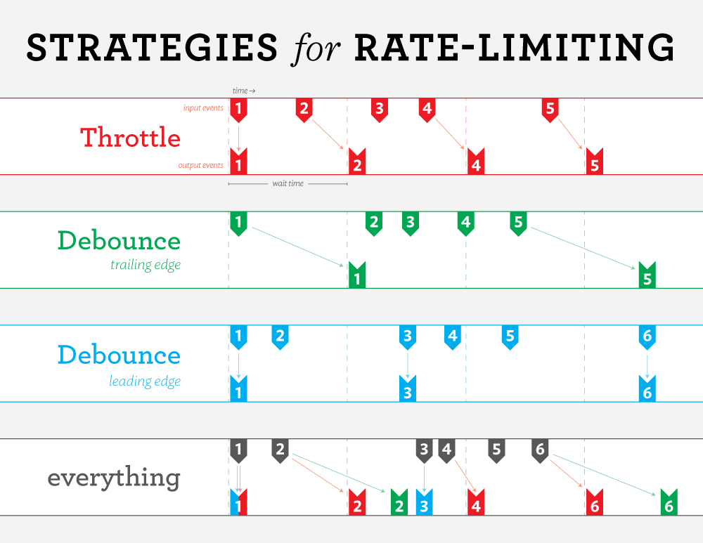

# Mobile hybride

## Jour 1

PWA : progresive webapp abjectif d'avoir un site adapter au mobile
React + PWA alors qu'on maitrise totalement Angular. En mobile moins de debat pour le mobile IOS c'est un mac c'est le seul OS qui permet de developer du mobile. Pour le dev en genrale on peut utiliser windox, linux... pas de preference. 
De meme pour les framework JS, pareil chacun à ses avantages et inconvenients. React est le framework le plus utiliser dans le monde du dev mbile hybride. Historiquement grosse dif entre je fais du mobile avec react native (couche abstraction perf ok); ou le choix react native script c'est un peu comme du electron qui permet de lancer l'application (voir les def). Modulo Lynx peut etre un concurent de react natif potentiel.


### React est un framework JS

Ca ne change pas trop Components avec des focntion, des props qui est un parametre des fonctions, des etats qui sont des variable locales des fonctions. 
Events evenement des fonctions avec un callback une fonction qui se lance
Données calculees qui est variables calculées des fonctions 


CF cours rapide sur React

Mauvais patern sur React d'utiliser useRef a eviter !!!!!

### Live coding

On va realiser les compteurs :
- Creer un compteur avec react
- Creer un composant compteur et utilsier une app 
- Ajouter un bouton pour incrementer le compteur
- Au montage du composant

### 3 methode dev mobile

3 possibilite de faire du dev mobile qui doit etre quel est le meilleur choix pour le projet : 
- App Web, un peu boostée (PWA), mais pas trop (Ionic) : PWA est une map web qui est booster exemple X Un service worker c'est une tache de fond qui permet de gerer le cache ce qui permet que les PWA sont prete pour offline
- App Hybride (React Natiive, Flutter, peut etre Lynx) on fait 1 code base pour 2 appli differente : deplacer les elements etc, 3d,..
- App Native (Switch, Kotlin, Java, Objective-C) on doit faire 2 code bas pour 2 aplli differente : jeu ou connecter iot


Faire du referencement dans un store on crrer une application vitrine qui ramene vers le store dans celui ci on doit mettre des mots cles, mettre en avant les telechargeemnt et commentaire
et c'est pour ca que le PWA est bien car ca ne coute rien
Mais possibilite de passer par PWA pour faire l'app mobile, et possibilite de passer PWA à app Hybride c'est le dev full stack ++


Electron c'est un chromium  VsCode c'est un chromium 
Tauri : https://v2.tauri.app/

https://nativescript.org/

c'est mieux  : https://lynxjs.org/


L'ordre à son importance
- TJM
- Temps de developpement
- Reutilisation du code
- Performance 
- Experience utilisateur
- Maintenance 


Une web app ne devrait pas etre autre choses qu'une PWA

- C'est trivial donc on le fait
- C'est trop bien sur le papier donc on evangelise
- En vrai c'est pas si ouf souvent problematique avec Apple


Worker c'est lancé un autre programe js qui fonctionne en fond et renvoie le resultat une fois finit ca permet de paralelliser le code
Service worker est un worker dedié au web
Le service worker va gerer les push notif une fois qu'il recoit un event push notif il renvoit à l'app
Il sert aussi au background task app n'est pas lancé qu'elle fasse des choses
tache de fond qui fait des choses pendant que l'app est fermé exemple les app podometre

Il existe plusieurs  methode de cache :

- cache only : pas interessant
- network only : exemple la connaissance meteo , ou connaissance de la bourse : connaissance de la derniere donnée a jour on s'en fiche de l'ancienne donné 
- cache first : si il y a du cache il repond à la page si pas de cache il recupere le cache du network exemple asset 
- networkfirt je veux des données toujours a jour par contre si j'ai pas de network, on recupere la derniere requete exemple la prise de rendez vous
- stale while revalidate 


https://vite-pwa-org.netlify.app/


Workbox 2 gros module
- generateSW : https://vite-pwa-org.netlify.app/workbox/generate-sw.html on vient configuerer avec ça plutot que le deuxeimen et il voudra recuperer le type de cache qu'on utilisera : https://developer.chrome.com/docs/workbox?hl=fr

- injectManifest


### Formulaire de saisie d'adresse 
creer une PWA
creer un formulaire de saisie d'adress
utiliser l'API du gouvernement pour la recherche d'adresse
Utiliser trottle vs debounce :



### Correction du TP formulaire


## Jour 2 et 3 ou bien jour 3 et 4 devoir à faire sur le mobile

SafeAreaView : bord arrrondi qui ne sont pas safe, une zone non accessible a ne pas developpé sur ecran

ScrollView : utiliser les bon outils

Platform : IOS ou Android if c'est IOS ... else ... mettre dans son code le type de platform

Style CSS : utiliser les bon outils pour avoir le style dans un mobile (pas talwind) on va tester vanilla

Pas hover mais des drag and drop

on va plus ecrire des div mais des views dans les balises quelque specificité mais ressemble à ce qu'on fait d'habitude


connaitre le choix expo qui est centralisé un peu comme next on ne passe plus par react native.

Pour etre propre dans le code on utilise expo
npx create-expo-app@latest
ajouter au start --tunel
"start": "expo start --tunnel",
safeareaview: est fournit par le constructeur. : https://docs.expo.dev/develop/user-interface/safe-areas/
Le safeareaview ne fonctionne plus a ce jour il faut donc utiliser un autre moyen avec provider:

Entouré toute l'application d'un provider :
https://appandflow.github.io/react-native-safe-area-context/api/use-safe-area-insets

insets : ecart qu'il a par raport à la droite en haut et en bas et on ajoute des padding : 

```ts
import { useSafeAreaInsets } from 'react-native-safe-area-context';

function HookComponent() {
  const insets = useSafeAreaInsets();

  return <View style={{ paddingBottom: Math.max(insets.bottom, 16) }} />;
}

```

Contexte en react a quoi ca sert : on revient sur l'histoire des parents a un enfant donc comment communiquer. Mais quand on part d'un parent a un ariere ariere petit enfant il faut faire des petits pont. 
Ce qu'on peut faire c'est que le parent possede de superpouvoir et ainsi il donnera le pouvoir au enfant reducts exemple -->
ce qui adore faire des classe mobx cas Angular Rjxx a voir https://mobx.js.org/README.html

revoir un observable definition.


https://zustand-demo.pmnd.rs/

dans l'outil on lui envoie tout les elements qu'on souhaite modifier. on garde la logique dans un composent si par contre il a des impacts sur les autres composant on extrait ceci pour pouvoir communiquer de parent a enfant 


Meme chose que pour les outils zustand et les classes on utilse contexte afin de communiquer entre parent component et enfant: 
https://react.dev/reference/react/useContext
on export mon contexte que j'ai creer et on l'utilise de tel maniere : 

```ts
import { useContext } from 'react';

function Button() {
  const theme = useContext(ThemeContext);
```

```ts
import { createContext, useContext } from 'react';

const ThemeContext = createContext(null);

export default function MyApp() {
  return (
    <ThemeContext value="dark">
      <Form />
    </ThemeContext>
  )
}

function Form() {
  return (
    <Panel title="Welcome">
      <Button>Sign up</Button>
      <Button>Log in</Button>
    </Panel>
  );
}

function Panel({ title, children }) {
  const theme = useContext(ThemeContext);
  const className = 'panel-' + theme;
  return (
    <section className={className}>
      <h1>{title}</h1>
      {children}
    </section>
  )
}

function Button({ children }) {
  const theme = useContext(ThemeContext);
  const className = 'button-' + theme;
  return (
    <button className={className}>
      {children}
    </button>
  );
}
```

Lorsqu'on va utilise SafeAreaProvider c'est une view qui va donc fournir à tous ses enfants.

SafeAreaView a voir si ca focntionne
useSafeAreaInsets 

https://react.dev/reference/react/useReducer

https://developer.mozilla.org/fr/docs/WebAssembly

https://www.tensorflow.org/?hl=fr


demander le package.json dans la recherche de travail si react + autre stack apolo voir les version à demander avant les entretiens


On est dans une logique contexte
provider 

# Cours : Le **Context** dans React

## 1. Pourquoi le Context ?

### 1.1 Le problème : « prop‑drilling »

* Dans React, les données voyagent **du parent vers les enfants** via les props.
* Lorsque vous devez transmettre la même donnée à un **arrière‑arrière‑petit‑enfant**, chaque composant intermédiaire ne fait que relayer la prop.
* Résultat : code verbeux, fragile, difficile à maintenir.

### 1.2 La solution : un “super‑pouvoir” partagé

* **Context** vous permet de créer un **magasin de valeurs** (thème, utilisateur, langue, etc.) que **tous** les descendants du *Provider* peuvent consommer sans intermédiaires.
* Imaginez un parent qui **partage directement** son pouvoir à n’importe quel enfant de l’arbre.

---

## 2. Mise en place rapide

```tsx
import { createContext, useContext } from 'react';

const ThemeContext = createContext<'light' | 'dark'>('light');

export default function App() {
  return (
    <ThemeContext.Provider value="dark">
      <Form />
    </ThemeContext.Provider>
  );
}

function Form() {
  return (
    <Panel title="Bienvenue">
      <Button>S’inscrire</Button>
      <Button>Se connecter</Button>
    </Panel>
  );
}

function Panel({ title, children }: { title: string; children: React.ReactNode }) {
  const theme = useContext(ThemeContext);       // <-- consommation
  return (
    <section className={`panel-${theme}`}>
      <h1>{title}</h1>
      {children}
    </section>
  );
}

function Button({ children }: { children: React.ReactNode }) {
  const theme = useContext(ThemeContext);       // <-- consommation
  return <button className={`button-${theme}`}>{children}</button>;
}
```

> **Étapes :**
>
> 1. `createContext` crée le conteneur.
> 2. Le **Provider** place la valeur dans l’arbre.
> 3. `useContext` la récupère à n’importe quel niveau.

---

## 3. Quand **ne pas** utiliser Context ?

| Besoin                                            | Recommandation                                                 |
| ------------------------------------------------- | -------------------------------------------------------------- |
| Valeur utilisée **partout** (thème, langue, auth) | **OK** pour Context                                            |
| **État local** à 2‑3 niveaux                      | Rester sur des **props**                                       |
| **État complexe** partagé par plusieurs pages     | Envisager **Zustand**, **Redux Toolkit**, **Jotai**, **MobX**… |

---

## 4. Context & autres outils d’état

### 4.1 MobX / RxJS (Angular)

* **MobX** : magasin *observable* ; un composant réagit aux variables qu’il **utilise réellement**.
* **RxJS** : flux d’`Observable` (async, streams) – populaire dans Angular.
* Combinez Context + MobX : exposez votre store MobX dans un Context pour garder l’API React simple.

### 4.2 Zustands

* **Zustand** (allemand : « état ») est un **micro‑store** minimaliste.

```ts
import { create } from 'zustand';

const useBearStore = create(set => ({
  bears: 0,
  addBear: () => set(state => ({ bears: state.bears + 1 }))
}));
```

* Pas besoin de Context : `useBearStore()` fonctionne n’importe où dans l’arbre, mais vous pouvez l’isoler derrière un Context si vous voulez.

---

## 5. Context avancé

### 5.1 Combiner avec `useReducer`

```ts
const FormContext = createContext(null);

function FormProvider({ children }) {
  const [state, dispatch] = useReducer(reducer, initialState);
  return (
    <FormContext.Provider value={{ state, dispatch }}>
      {children}
    </FormContext.Provider>
  );
}
```

* On obtient un **dispatcher** façon Redux mais **sans dépendance externe**.

### 5.2 Context dans React Native

```ts
import { SafeAreaProvider, useSafeAreaInsets } from 'react-native-safe-area-context';

export default function App() {
  return (
    <SafeAreaProvider>
      <MyScreen />
    </SafeAreaProvider>
  );
}

function MyScreen() {
  const { top } = useSafeAreaInsets();
  return <View style={{ paddingTop: top }} />;
}
```

* **SafeAreaProvider** expose les `insets` d’écran (encoches, Dynamic Island…) via Context.
* **SafeAreaView** est un wrapper pratique qui **consomme** ce Context pour appliquer le padding automatique.

---

## 6. Bonnes pratiques

1. **Un Context par souci** (Theme, Auth, Locale…).
2. Évitez d’y stocker des valeurs qui **changent à chaque rendu** (fonctions anonymes, objets recréés) ; mémoïsez‑les (`useMemo`, `useCallback`) ou passez un **réducteur**.
3. **Versionnez vos dépendances** : avant un entretien, ouvrez `package.json`/`pnpm-lock.yaml`/`yarn.lock` pour vérifier :

   * `react`, `react-dom`, `react-native`.
   * Outils d’état : `@tanstack/react-query`, `zustand`, `redux-toolkit`, `mobx`…
   * GraphQL : `@apollo/client` (v3 → hooks, v4 → suspense)…
   * TypeScript, ESLint, tooling (Vite, Next.js 15, Expo 50, etc.).

---

## 7. Pour aller plus loin

| Sujet                       | Pour quoi faire ?                                                                                    |
| --------------------------- | ---------------------------------------------------------------------------------------------------- |
| **WebAssembly**             | Exécuter du code C/Rust/Go dans le navigateur (perf, FFT, encodage).                                 |
| **TensorFlow\.js**          | Charger un modèle ML et l’inférer côté client ou React Native.                                       |
| **React Server Components** | Réduire le JS envoyé au client ; parfois remplace certains Context globaux par un **cache serveur**. |

---

## 8. Récapitulatif

* **Context** résout le **prop‑drilling** : partage d’une valeur à tout un sous‑arbre.
* Pour de l’état **très transversal** ou **persistant**, préférez un **store dédié** (Zustand, Redux, MobX).
* En React Native, beaucoup de libs (SafeAreaProvider, GestureHandler) reposent sur Context pour injecter des infos système.
* Combinez‑le intelligemment avec `useReducer`, des **observables** ou un **micro‑store** pour garder un code clair et scalable.

---

> **TL;DR** : « Quand c’est un **super‑pouvoir** dont tous les descendants ont besoin → **Context**. Quand c’est l’état interne d’un composant → **props/état local**. Quand c’est l’état global de l’application → **store dédié**. »


https://reactnative.dev/docs/dimensions


https://reactnavigation.org/docs/getting-started

https://docs.expo.dev/versions/v51.0.0/sdk/bar-code-scanner/


on demarre au debuut avec l'envie de partir sur du web
on bascule sur mobile pour les maps
lorsqu'on passe au dessus on perd des couts...

Pourquoi passer au mobile
performance (jeu, etc...) a prendre en compte quand on passe au mobile
nouveauté eco systeme smart watch, casque vr, lunette connecté 

