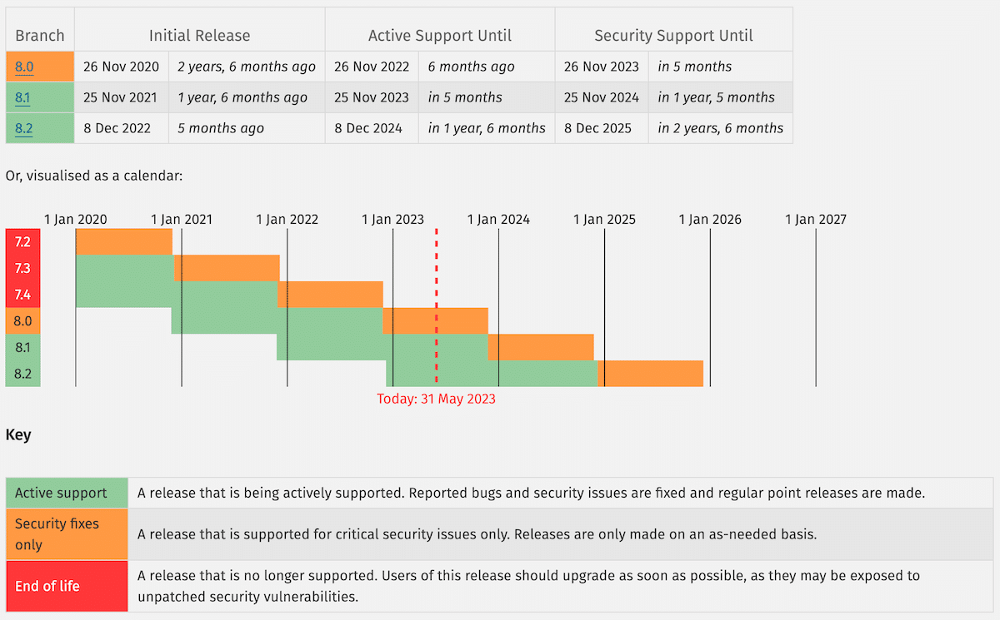

# Framework PHP

## Notation

- Rendre un bout de projet en symphony avec quelques fonctionnalités : rendu projet symphony à rendre sur github
- Quizz ou explication de code à voir

Symphony c'est français, beaucoup d'offre de dev symphony(https://symfony.com/)

 (vs laravel framework americain qui monte en puissance) : https://laravel.com/

C'est une ecriture du back end 

PHP 7 avancé livre : https://www.amazon.fr/AVANCE-MARTIN-PAULI-GEYER-DASPET/dp/2212143575

## Un peu d'histoire

Zend Engine (Zeev et Andi) c'est leur 2 prenoms

POO arrivé en PHP 5 2004; pas de PHP 6 bizarement : Le début du développement de la version 6 de PHP date de 2005 et a été abandonnée en raison de difficultés d'intégration du support Unicode

PHP 7 : grosse sortie et une grosse perfo

PHP 8 : depuis 2020 on passe en 8 JIT (just-in-time) accelere le process utilisation PHP
Concrètement, JIT permet un traitement beaucoup plus rapide des contenus dynamiques générés « à la volée » par PHP, en compilant et en optimisant le code (juste) au moment de l’exécution. Ce processus élimine le besoin de précompilation du code et permet donc aux scripts d’être exécutés plus rapidement.

## PHP c'est quoi ? 

PHP est un language de script open source ecrit en C.
C'est un language web qui peut etre integrer dans une page HTML

A la diverse de JS, le code PHO est exécuté côté serveur, ce qui genere du HTML qui est ensuite renvoyé au client.
Le client n'a donc pas acces au code origine (le code dans inspecter)

PHP represente environ 75% du web 

Le Code Legacy : également appelé "code hérité" ou "code historique", désigne des anciennes applications informatiques ou des morceaux de code qui ont été développés dans le passé et qui continuent d'être utilisés.

AST : present depuis la verison 7 : Votre code est rempli de conditions, variables, fonctions, … et tout cela est interprété pour être exécuté. L’AST va permettre d’avoir une arborescence de tout votre code et de le parcourir tel un objet/JSON. Chaque langage a son/ses interpréteurs.

## Cycle de sorties et support  

2 ans support active 2 ans support securite 

https://kinsta.com/fr/blog/versions-php/

Pendant 4 ans PHP assure la secruté en version orange, il y a seulement des maj en securité 

Au bout de 4 ans la versions sera vunerable aux attaques

## Convention de numérotation

PHP suit la convention SemVer (semantic Versioning)
Chaque chiffre à un sens
MAJEUR.MINEUR.CORRECTIF

Majeur : changement non retrocompatibles
Mineur : ajout de fonctionnaloté retrocompatible
Correctif : quand il y a des correction d'anomalies retrocompâtble (des patchs)

serverité de bug.

change log : a chque sortie de version normalement on a un changelog:  journal des modifications

## Fonctionnement et gouvernance

rfc : proposition pour les nouvelle fonctionalité sur PHP / https://wiki.php.net/rfc

## THE PHP Foundation 

Au depart, tout se repose sur une personne Nikita Popov.
Il faut eviter le "bus factor", si la personne n'est plus la il faut etre capable de recuperer son travail. Qu'il ait des backend . La fondation ressamble les grands acteurs du monde de PHP ainsiq que des mecenes individuel. Afin de financer des dizaine de devs en temps plein ou partiel.
Le financement est decorelé de la gouvernance. : https://thephp.foundation/

## Communauté

Tres grosse communauté et bienvaillance pour les gens qui commence

Recommandation, aller à des evenements, creer un resaux, creer une antenne  : https://afup.org/home

https://barometre.afup.org/report/2024

## Ecosysteme

La grande force de PHP est sa maturité et son riche ecosysteme d'outils

- composer : gestionnaire de dependances : exactement comme un npm 
- rector : upgrade et refactorisation automatisés : analyser si elle est compatible avec la nouvelle version, il check le code et rectifie automatiquement dans certain cas auto fix
- Xdebug : debugger son code php par exemple au niveau 0 vardump pour voir la variable et le type 
- PHPStan : analyse statique : avec une lecture il peut detecter les erreurs sans lancer le serveur par exemple; permet egalement de repsecter le standard a choisir le niveau 7 plus tu montes plus c'est difficile. installe en log qui se joue avant de pousser sa branche dans github (pour la partie format)
- PHPUnit : pour les tests unitaires : la base de tout projet; on test un bout de code unitairement 
methode TDD on ecrit le test avant d'ecrire la fonction à voir pour le projet

## Convention de code

Principes clean code en PHP : sur github
PSR : recommandation de bonne pratique c'est un groupe de recommandation qui se mettent d'accord sur utilisation de PHP. Definir un standard
Qaund la PSR a evolué, elle devient une PER

Exemple : PSR sur la syntaxe

## Frameworks

On utilisera symphony
api platform : français pour utiliser api / https://api-platform.com/

## CMS

- Drupal
- Joomla
- Magento
- Sylius
- Wordpress

slidesgo

https://openclassrooms.com/fr/courses/1665806-programmez-en-oriente-objet-en-php

Possibilité de passer un certif symphony

https://tech.io/playgrounds/98407/initiation-a-la-programmation-avec-php-script/hello-world

https://aymeric-auberton.fr/academie/php/

https://www.w3schools.com/php/

on peut typer php strict type

Pour la syntaxe:

on peut dans les variable mettre des chiffre mais pas au debut
on peut prendre maj min et underscore, chiffre sauf le debut

Les commentaires, servent à expliquer le pourquoi on utiliser cette focntion, ou la technique au lieu d'expliquer la fonction 
ADR : architecure systeme record : on ecrit pourquoi on utilise ce choix techniqu; il s’agit de documents qui permettent de retracer toutes les décisions d’architecture importantes qui concernent un logiciel, en leur apportant du contexte.

caster

place older %S pour string
print 
printf
echo

array_pop(array &$array): mixed

& signifie que cela aura un impact sur l'original

avec define une constante est forcement global meme si on l'appele dans une fonction sans la metttre dans l'argument il sera appeler
https://www.php.net/manual/fr/function.define.php
Aujourd'hui on utilise pas define mais const

defensive programming

