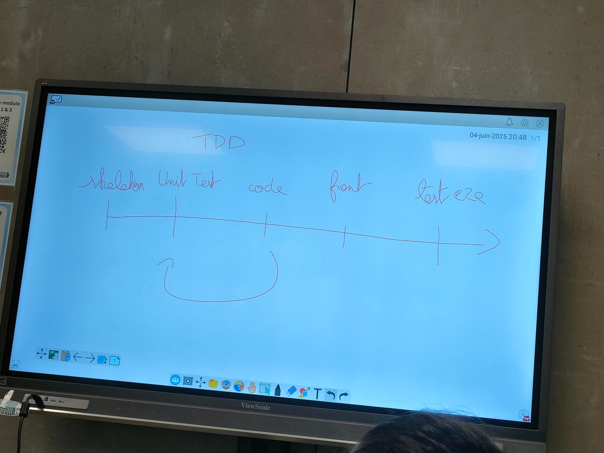

# Qualité Logicielle

## Amelioration de la qualité logiciel

La qualité de code est de revenir sur son code pour le rendre plus lisible. Il est tres depend de notre niveau.

Ca passe par : 
- architecture
- non repetition des fonctions et elemnts 
- veille
- documenter
- normaliser le code
- design pattern : des solutions classiques à des problèmes récurrents de la conception de logiciels

## Quelque bonne pratique pour mon code

- des noms de variables :
    - en anglais
    - raccourcis
    - conventions de nommage du language: CamelCase / snake_case
    - commentaires utilse / necessaires
    - utilisation des tricks raisonnée : tata!.toto ou tata??toto
    - l'indentation
        - tab vs espace
        - sauts de ligne
    - DRY : don't repeat yourself
    - ecire le moins de lignes possible ESLint : https://eslint.org/ : prendre la coche ✅ // https://prettier.io/

DX : c'est un metier qui ameliore la qualité des developpeur, automatiser les choses ameliorer le process

## Linter

Le linter détectra ...

## Storybook

c'est la communication entre dev et UX/UI c'est assez problematique car il y a de l'iteration et du delai.

Le fait d'utiliser storybook : de faire un composant isolé pour tester le bouton par exemple : 
https://bit.dev/ 

https://storybook.js.org/tutorials/intro-to-storybook/react/en/get-started/

https://react-ui-storybook.vercel.app/?path=/docs/preldls-components-accountitem--docs

## Logger

Plus qu'un simple console.log()

Comme debugger
console.log(toto)
console.time('toto')
console.timeEnd ('toto')

Stack Winston : quel serait le logger ultime :
- template de messsage (timestamp)
- niveau / degres de 
{
  emerg: 0,
  alert: 1,
  crit: 2,
  error: 3,
  warning: 4,
  notice: 5,
  info: 6,
  debug: 7
}

Avoir des transport : moyen de transporter des informations de la prod c'est comme le rapport erreur de windows

## Markdown is the new Txt

Documentation, Readme, notes, cours en diapos ...

## Docusaurus 

https://docusaurus.io/docs/markdown-features

## Git 
Important de connaitre les commandes de git
convention de commit

## Husky

un outil de pre commit : https://typicode.github.io/husky/
qui permet de verifier le commit si ça plante il ne passe pas
c'est de la CI local 

## CI pour Continuous Integration

Gitlab vs Gitbub

Differents pings pour differentes actions
https://blog.stephane-robert.info/docs/devops/racines/

La pratique de l'intégration continue (CI) consiste à intégrer automatiquement et régulièrement les modifications de code dans un référentiel de code source partagé.La distribution et/ou le déploiement continus (CD) désignent quant à eux un processus en deux volets qui englobe l'intégration, les tests et la distribution des modifications apportées au code. La distribution continue se limite au déploiement automatique dans les environnements de production, alors que le déploiement continu publie automatiquement les mises à jour dans ces environnements.

### Qu’est-ce que l’intégration continue ? (CI)
L'intégration continue est une bonne pratique DevOps et une étape du cycle de vie DevOps au cours de laquelle les développeurs enregistrent du code dans leur dépôt de code partagé, souvent plusieurs fois par jour. Idéalement, à chaque fois que cela se produit, un outil de compilation automatisé vérifie la validation ou la branche pour s'assurer qu'il n'y a pas d'erreurs et que le code est prêt à être mis en production. Le principal avantage ici est que les problèmes sont généralement détectés tôt, avant qu'ils ne se transforment en difficultés plus importantes.

L'intégration continue signifie intégrer de petits sous-ensembles de changements dans un laps de temps plus court, plutôt que des mises à jour substantielles qui prennent plus de temps et qui sont intégrées moins souvent. L'automatisation des flux de production pour tester, fusionner et vérifier les modifications apportées à un dépôt partagé permet aux équipes de fournir un code plus propre à un rythme plus rapide. Un code plus propre signifie une validation plus rapide, des versions plus propres et un pipeline de développement plus efficace et plus facile à faire évoluer.

### Comment fonctionne l’intégration continue ?
L'intégration continue est une bonne pratique DevOps et une étape du cycle de vie DevOps au cours de laquelle les développeurs enregistrent du code dans leur dépôt de code partagé, souvent plusieurs fois par jour. Idéalement, à chaque fois que cela se produit, un outil de compilation automatisé vérifie la validation ou la branche pour s'assurer qu'il n'y a pas d'erreurs et que le code est prêt à être mis en production. Le principal avantage ici est que les problèmes sont généralement détectés tôt, avant qu'ils ne se transforment en difficultés plus importantes.

L'intégration continue signifie intégrer de petits sous-ensembles de changements dans un laps de temps plus court, plutôt que des mises à jour substantielles qui prennent plus de temps et qui sont intégrées moins souvent. L'automatisation des flux de production pour tester, fusionner et vérifier les modifications apportées à un dépôt partagé permet aux équipes de fournir un code plus propre à un rythme plus rapide. Un code plus propre signifie une validation plus rapide, des versions plus propres et un pipeline de développement plus efficace et plus facile à faire évoluer.

## Docker 

Regle le telphone arable des env de dev
il suffit de  :
- installer dicker
- un fichier de config
- demarrer notre container

## La QA 

Code review ? pas eux mais juste avant de leur donner du travaill
- Tester en conditions réélles, double check
- Faire le point sur les avancées générales
- Mutualiser les solutions
- Conserver une homogénéité du code
- Actifs dans les releases
- Pas des surhommes non plus

## Les tests

### Tester ce n'est pas un peu douter ? 

Un test c'est confronter une assertion à une realité.
Comment peut-on tester notre code ou notre futur code ? 
On ne jete jamais les tests pour eviter la regretion

Les tests ça coute cher est ce vraiment utile
qui peut tester les dev PO,.... à voir

### BDD vs TDD etc..

Test driven development (TDD) is a technique of using automated unit tests to drive the design of software and force decoupling of dependencies. The result of using this practise is a comprehensive suite of unit tests that can be run at any time to provide feedback that the software is stil working

Behavior-Driven Development (BDD) combines the general yechn and principles of TDD with ideas drom domain-driven design. BDD is a design :https://cucumber.io/docs/installation/javascript/

### Test unitaire

Les tests unitaires 

## Test unitaire

Un test c'est confronter une assertion à une relatite.
Comment peutt on tester notre code ou notre futur code? En refelchissant aux valeurs extremes et validant le besoin

On les garde oiyr eviter des effets de bords et chiffrer notre couverture de tests

Ce sont les developpeurs qui test le code

### Les criteres d'un bon test unitaires

1. Unité : tester les bout de code ligne par ligne
2. Isolation : test unitaire doit etre isoler des autres
3. Rapidité : avoir les test en tant reel
4. L'independance : pseudo aleatoire; CID avce nombre aleatoire a figer la seed si on souhaiter tester un nombre aleatoire
5. automatisable : 
6. Rejouabilité : les tests doivent toujours marcher

Bonus:

les test doit etre tres rapide
Quand il a un bug ou ecrit ou modfie le test unitaie c'est de TDD
Premiere choses c'est de reproduire le bug, de figer avec un test 
Choissier la bonne unité
Template AAA
https://jestjs.io/fr/

https://github.com/sapegin/jest-cheat-sheet

expect est une assertion

### Jour 2 quality back vs front

Au back on creer le test unitaire avant la fonction, par contre pour le front il est interressant de faire des test E2E c'est a dire creer la fonction et ensuite le test afin qu'on puisse tester la fonction 

Possibilité de revenir de code à test unitaire suite à :
- une feature modification du code 
- bugfix observer par le client final : objectif recreer le bug 

#### A quoi sert les tests end to end

- Cahier des charges avec des scenarios utilisateur clairement définis c'est souvent product owner PO; on va voir outil de communication entre le PO et la realistaion de tache
- Apres la periode de developpement de ces scenrios, les tests E2E permettent leur validation
- Tests de non - regression
- Automatisation des tests coté client (long formulaire à remplir) Test efficace de l'application dans des contextes d'executioin differents (Firefox,Chrome,Edge,..)
- les test E2E sont limmités au DOM. On ne teste donc que ce qui est accessible par l'utilisateur final.
- Certaines mauvaises pratques peuvent compliquer ou rendre infaisables les tests.Par exemple s'il n'ya pas d'id ou de name sur les champs d'un formualire dans le fichier HTML fera echouer le test/
- Les tests E2E prennent beaucoup de temps à maintenir
- Ils ne remplacent pas l'utilisateur final

#### Playwright

Apres puppeteer à utiliser dans le cours 
Playwright c'est un nouveau scrapper sur node qui est maintenu . Un scrapper c'est un emulateur d'application qui permet de tester sur ce faux appli. Pourquoi cet ouil Microsfot et multi languages
https://playwright.dev/

concurrence : jest et cypress(85% du marché)

#### La dcomuentation 

https://playwright.dev/

- API proche de jest (expect syntax)
- Installation simple dans une application
- configuration navigateur timeout
- possibilite avancées
- analyse du code exemple

Il faut un serveur x 

https://playwright.dev/docs/locators#locate-by-test-id

Test E2E tres utilisé par les PO car ils connaissent le produuit finit

Test E2E tres utilisé par les PO car ils connaissent le produit finis

Jeudi matin : continuer sur le sequelette jeu de dés
Jeudi apres midi : 13h15 à 17h devoir test E2E pour front et test unitaire back
En distanciel 
